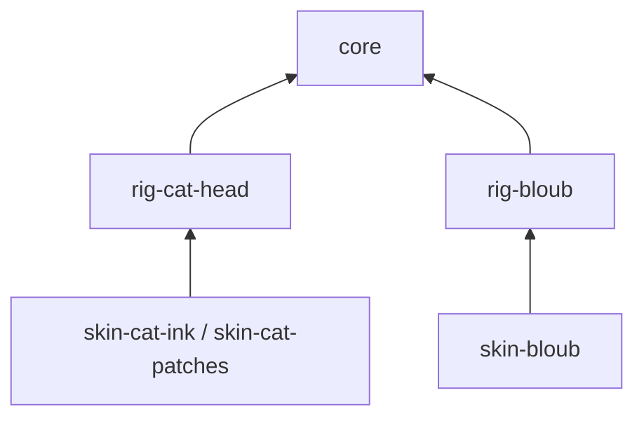

# Mofli

框架无关的 SVG 角色引擎，按 **1 个核心 + N 个骨架包 + M 个皮肤包** 组织。React、Vue、Amiba 和演示页都属于使用方，不是引擎依赖。

当前在同一个 npm workspace 管理 6 个引擎包及 1 个独立预览项目。每个包有自己的 manifest、源码、编译配置和产物；可以移到独立仓库，在安装声明的依赖后单独构建。包名暂用 `@mofli/*`，全部 private，尚未发布，也未验证 npm scope 归属。



箭头表示直接依赖。皮肤包只直接依赖一个骨架包；核心由骨架间接引入。一个骨架可以有任意多个独立皮肤包，每个皮肤包只提供一款皮肤及其 PetDefinition，皮肤列表由宿主组合。

## 包与职责

| 包项目 | 职责 | 直接运行依赖 |
| --- | --- | --- |
| [@mofli/core](packages/core) | Rig / Skin / Frame 协议，校验、时钟、事件、行为、注册表、通用绑定和 SVG 渲染 | 无 |
| [@mofli/rig-bloub](packages/rig-bloub) | Bloub 参考角色的轮廓、五官、约束、14 状态与姿态过渡 | core（peer） |
| [@mofli/skin-bloub](packages/skin-bloub) | Bloub 原色皮肤 | rig-bloub |
| [@mofli/rig-cat-head](packages/rig-cat-head) | 猫头轮廓、猫耳、五官与动作约束 | core（peer） |
| [@mofli/skin-cat-ink](packages/skin-cat-ink) | 墨黑 | rig-cat-head |
| [@mofli/skin-cat-patches](packages/skin-cat-patches) | Patches 拼色 | rig-cat-head |
| [@mofli/studio](examples/studio) | 独立预览应用及 Vite 工具链 | 按需消费 core、骨架和皮肤 |

`core/browser` 是核心包的浏览器入口；默认 `core` 入口不读取 DOM。核心不内置骨架目录，也不会自动注册具体角色。实验宠物保持原有实验定位，并非本轮新增的视觉作品。

## 本地开发

```sh
npm install
npm run dev             # 先构建各包，再启动演示页；默认首页为 Bloub
npm test                # 构建及核心、参考动画、依赖边界测试
npm run typecheck       # 各包与演示客户端类型检查
npm run build:demo      # 构建包及静态演示页，输出 examples/studio/dist/
npm run test:packages   # 仓库外逐包构建、打包、安装并运行消费项目
MOFLI_BROWSER_CHANNEL=chrome npm run test:browser
```

修改包源码后运行 `npm run build` 更新其 `dist/`；演示页通过真实包 exports 加载产物，不使用源码路径别名。独立构建某包：`npm run build --workspace @mofli/rig-bloub`，前提是核心已构建。

## 使用皮肤包

```ts
import { createPet } from '@mofli/core/browser';
import { bloubPet } from '@mofli/skin-bloub';

const pet = createPet({
  container: document.querySelector('#pet')!,
  ...bloubPet,
});
// 卸载组件时：pet.destroy();
```

`bloubPet` 是 `{ rig, skin }`，由皮肤包装配；不要求宿主再次手工查找骨架。需要自己管理时钟时使用 `PetEngine` 和 `createSvgRenderer`。渲染器支持带实例命名空间的 mask、linearGradient 和类型化变换，不接受直接注入 SVG 字符串。

## 新建一个皮肤包

皮肤项目只声明 `@mofli/rig-bloub` 依赖，通过骨架提供的工厂创建数据：

```ts
import {
  bloubRig, defineBloubSkin,
  type Skin, type PetDefinition,
} from '@mofli/rig-bloub';

export const skin: Skin = defineBloubSkin({
  id: 'sage', name: 'Sage',
  colors: { body: '#456B58', paper: '#F7F4EC' },
});
export const pet: PetDefinition = { rig: bloubRig, skin };
```

骨架工厂固定 Rig ID、补全并校验颜色槽。Skin 包含外观和可选 rigConfig 默认几何配置，状态和表情通过 pose 设置。猫头现支持受约束的表面花纹和眼睛样式，骨架负责投影、形变与遮挡；任意纹理和材质尚未实现。见 [表面皮肤协议](docs/surface-skins.md)。

## 新建一个骨架包

骨架项目声明 `@mofli/core` peer dependency，导出符合 `Rig` 的实现、自己的皮肤工厂，以及供皮肤作者使用的类型。具体规则和独立项目示例见 [包架构](docs/packages.md)。

结构、动作、约束和过渡属于骨架。`Rig.updateSkin` 可接管姿态过渡；缺省时使用核心的兼容路径插值/不兼容帧淡化。一个骨架的球面投影或 64 点轮廓不是所有骨架必须遵守的模型。

## 来源与边界

`rig-bloub/src/vendor` 是保留来源及 MIT 许可的 Bloub 核心动画移植，包含我们的状态控制器 fork 和小坐标路径精度修复。拆包没有把这些算法变成 Mofli 原创算法。许可随参考骨架和皮肤包分发，见 [THIRD_PARTY_NOTICES.md](THIRD_PARTY_NOTICES.md) 与 [参考集成说明](docs/bloub-reference.md)。

Rig 是可信可执行代码；当前没有不可信插件沙箱。引擎支持当前事件快照下的确定性采样，不是完整历史事件重放。通用过渡不承诺速度连续。当前没有四足 IK、通用骨架编辑器或 Amiba 插件适配。


## 当前主展示：Bloub 与猫头

主展示统一提供 Bloub 参考骨架和猫头骨架。三款皮肤均可从主页面按骨架选择。猫头完整移植 Bloub 的 14 个状态，身体、五官和装饰采用带 MIT 声明的参考计算，增加随轮廓变形和按状态收拢的猫耳。旧的五状态猫头已替换，无鼻子、胡须。墨黑皮肤保留耳长和脸型调整，不为参数变体单独提供皮肤。

猫头包仅依赖 core，内部包含独立的参考实现，不导入其他骨架包。当前参数和限制见 [猫头骨架说明](docs/cat-head.md)。

## 配置分层

皮肤可以携带 rigConfig 默认几何值。换肤应用外观和几何，保留当前动作与表情。exportSkin 保存调整后的外观与几何。没有独立骨架预设概念，见 [分层协议](docs/character-layers.md)。
